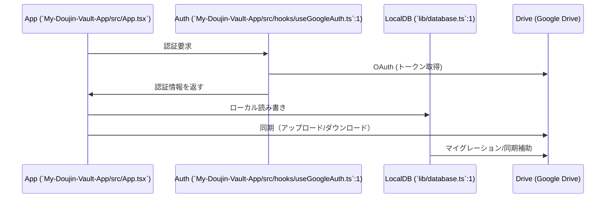

# アーキテクチャ概要

本プロジェクトはクライアントサイド中心のサーバーレス設計を採用します。React Native + Expo を用い、ユーザーのデータはユーザー自身の Google Drive に保存されます。ローカルには Expo-SQLite を利用したキャッシュ用 DB を持ち、主要操作はローカル DB で行われます。参照: [`docs/MyDoujinVault.md`](docs/MyDoujinVault.md:1)

# データフロー（簡易Mermaid 図を1つ含める）

参照: アプリ起動 -> 認証 -> ローカルDB -> Google Drive 同期フローを示す。

# DBスキーマ & マイグレーション（参照: [`lib/database.ts`](lib/database.ts:1), [`My-Doujin-Vault-App/src/migration/modeMigration.ts`](My-Doujin-Vault-App/src/migration/modeMigration.ts:1)）

- ローカルは Expo-SQLite を用いた単一ファイル DB。検索・一覧表示はここを直接参照して高速化する。参照: [`lib/database.ts`](lib/database.ts:1)
- 管理モード切替や初期データ生成はマイグレーションで扱う。参照: [`My-Doujin-Vault-App/src/migration/modeMigration.ts`](My-Doujin-Vault-App/src/migration/modeMigration.ts:1)

# 状態管理（参照: [`My-Doujin-Vault-App/src/store/authStore.ts`](My-Doujin-Vault-App/src/store/authStore.ts:1), [`My-Doujin-Vault-App/src/store/modeStore.ts`](My-Doujin-Vault-App/src/store/modeStore.ts:1)）

- 認証状態、現在の管理モード、UI 設定などはストアで集中管理する。
- 小さく分離されたストア（authStore, modeStore）により責務を明確化し、テスト性を高める。参照: [`My-Doujin-Vault-App/src/store/authStore.ts`](My-Doujin-Vault-App/src/store/authStore.ts:1), [`My-Doujin-Vault-App/src/store/modeStore.ts`](My-Doujin-Vault-App/src/store/modeStore.ts:1)

# 認証フローと外部連携ポイント（参照: [`My-Doujin-Vault-App/src/hooks/useGoogleAuth.ts`](My-Doujin-Vault-App/src/hooks/useGoogleAuth.ts:1)、[`services/driveService.ts`](services/driveService.ts:1)（存在する場合））

- 認証: Google OAuth を採用。`useGoogleAuth` フックでトークン管理とリフレッシュを行い、取得したアクセストークンを使って Drive へアクセスする。参照: [`My-Doujin-Vault-App/src/hooks/useGoogleAuth.ts`](My-Doujin-Vault-App/src/hooks/useGoogleAuth.ts:1)
- ドライブ連携: Drive とのファイル読み書きは専用サービス（`services/driveService.ts`）経由で行う想定。存在する場合は該当サービスを参照して実装詳細を確認する。参照: [`services/driveService.ts`](services/driveService.ts:1)（存在する場合）

# 開発上の注意点（.env、Prettier/ESLint 設定の簡易記載）

- 環境変数: Google OAuth のクライアント ID や iOS スキームは `My-Doujin-Vault-App/.env` に保存し、ソース管理に含めないこと。
- コーディング規約: Prettier はシングルクォート、トレーリングカンマ等を指定。ESLint は `expo` と `@typescript-eslint` を利用。ルールに沿ってフォーマット/リンティングを行うこと。
- テスト: 重要ロジック（DB 操作・マイグレーション・ストア）はユニットテスト化を検討。現在のリポジトリにはテストランナー未設定の可能性があるため、導入時は Jest + React Native Testing Library を推奨する。
